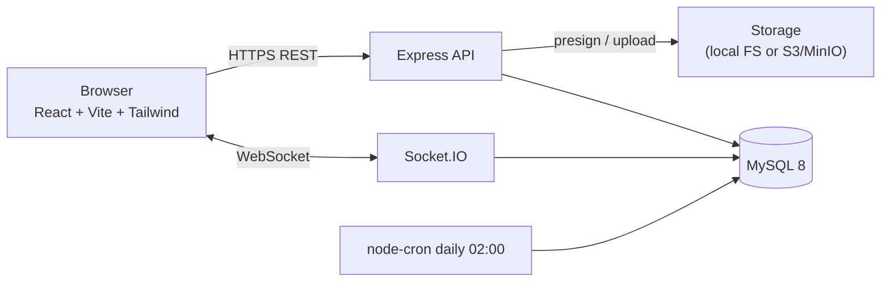

# Group Chat App

A real-time group messaging application with authentication, group management, role-based access, file sharing, and a configurable storage backend.

> Built as a learning project to demonstrate end-to-end backend skills (REST + WebSockets + RDBMS + caching/queueing patterns) and modern React frontend development.

---

## Tech Stack

| Layer        | Tech                                                                  |
| ------------ | --------------------------------------------------------------------- |
| Backend      | Node.js 20, Express 5, Socket.IO 4, Sequelize 6, MySQL 8              |
| Auth         | JWT (HS256), bcryptjs (12 rounds)                                     |
| Validation   | zod (typesafe schemas)                                                |
| Security     | helmet, express-rate-limit, CORS, request size limits                 |
| Storage      | Pluggable driver — local filesystem **or** AWS S3 / MinIO             |
| Cron         | node-cron (daily message archiving)                                   |
| Logging      | winston (JSON in prod, colorized in dev)                              |
| Frontend     | React 18, Vite 5, TypeScript 5, Tailwind 3, react-router 6, axios     |
| Real-time    | socket.io-client with JWT handshake auth + auto-reconnect             |
| DevOps       | Docker, docker-compose, multi-stage builds, Nginx for static serving  |

---

## Features

- 🔐 Email/password signup + login with JWT, password hashing (bcrypt 12 rounds)
- 👥 Create groups, invite users, promote to admin, remove members, leave a group
- 💬 Real-time messaging via Socket.IO with **authenticated handshake**
- 📥 Server-side message persistence (clients cannot spoof userId)
- ⌨️ Live typing indicators (throttled, auto-clearing)
- 📎 **Attachments**: images (10 MB), video (100 MB), audio (25 MB), PDF/Office docs (25 MB), zip (50 MB)
   - Inline image preview, HTML5 video player, audio player, file cards with mime badge
   - Direct-to-S3 presigned uploads in prod; local-disk driver in dev — same client code
   - Per-mime size enforcement on the server
- 🗄️ **Three-tier message lifecycle** — daily cron moves messages older than 24h to `ArchivedMessages` (warm), weekly cron moves rows older than 30 days to `ColdMessages` (cold). "Load older" UI fetches warm + cold tiers with subtle badges.
- 🧩 **Hash sharding by `groupId`** (opt-in via `SHARD_COUNT`) — meta tables stay on one DB, message tables split across N shards. Default `SHARD_COUNT=1` is identical to non-sharded behavior.
- 🛡️ Rate limiting (10 attempts / 15 min on auth, 100 / 15 min on /api)
- 🔍 zod-validated request bodies, query strings, and route params
- 📊 Structured logging, global error handler, graceful shutdown (SIGTERM/SIGINT)
- ♻️ **Horizontal scale ready** — drop-in Socket.IO Redis adapter activated by `REDIS_URL`
- 🐳 One-command local dev with `docker compose up`

---

## Architecture (high level)



See [docs/HLD.md](./docs/HLD.md) for detailed architecture, [docs/LLD.md](./docs/LLD.md) for schema and sequence diagrams.

---

## Project Structure

```
Group-Chat-App/
├── app.js                       # Express app factory (security, routes, error handler)
├── server.js                    # HTTP boot + Socket.IO + graceful shutdown
├── config/
│   ├── env.js                   # zod-validated env loader (fails fast on bad config)
│   └── db.js                    # Sequelize instance + connection pool
├── controllers/                 # signup, login, group, file
├── middlewares/
│   ├── authenticate.js          # JWT verify + isGroupAdmin
│   ├── isGroupMember.js         # group membership check
│   ├── validate.js              # generic zod validation middleware
│   ├── rateLimiter.js           # apiLimiter + authLimiter
│   └── errorHandler.js          # 404 + global error mapper
├── models/                      # Sequelize models + associations
├── routes/                      # express routers
├── services/
│   ├── socketService.js         # Socket.IO with JWT auth + persisted messages
│   ├── storageService.js        # local | s3 driver
│   └── archiveMessages.js       # transactional move of old messages
├── validation/                  # zod schemas (auth, group, message)
├── utils/                       # ApiError, catchAsync, logger
├── cron/archiveJob.js           # node-cron schedule
├── scripts/testInsert.js        # manual seed for archive testing
├── frontend/                    # React + Vite + TS + Tailwind SPA
├── docs/                        # HLD, LLD, INTERVIEW, API, DEPLOYMENT
├── docker-compose.yml           # MySQL + MinIO + backend + frontend
├── Dockerfile                   # backend multi-stage build
└── frontend/Dockerfile          # frontend multi-stage build (Nginx)
```

---

## Quick Start

### Option 1 — Docker (recommended, zero setup)

Requires Docker Desktop.

```bash
git clone https://github.com/jatingyass/Group-Chat-App.git
cd Group-Chat-App
docker compose up --build
```

That's it. The stack starts:

| Service   | URL                       | Notes                                      |
| --------- | ------------------------- | ------------------------------------------ |
| Frontend  | http://localhost:5173     | React app                                  |
| Backend   | http://localhost:5000     | Express API                                |
| MySQL     | localhost:3306            | user `app`, password `apppass`             |
| MinIO     | http://localhost:9001     | console; user/pass `minioadmin`/`minioadmin` |

### Option 2 — Local development (faster reload)

Requires Node.js 20+ and a MySQL 8 instance.

```bash
# 1. Backend
cp .env.example .env
# edit .env with your DB credentials and a long JWT_SECRET
npm install
npm run dev                 # nodemon, restarts on changes

# 2. Frontend (separate terminal)
cd frontend
cp .env.example .env
npm install
npm run dev                 # Vite, http://localhost:5173
```

Generate a strong `JWT_SECRET` with:

```bash
openssl rand -base64 64
```

---

## Environment Variables

See [.env.example](./.env.example) for the full list with comments. Key ones:

| Variable          | Default            | Description                                  |
| ----------------- | ------------------ | -------------------------------------------- |
| `NODE_ENV`        | development        | `development` enables auto sync + dev logs   |
| `PORT`            | 5000               | Backend HTTP port                            |
| `CORS_ORIGIN`     | http://localhost:5173 | Frontend origin (comma-separate for multiple) |
| `DB_*`            | —                  | MySQL connection details                     |
| `JWT_SECRET`      | —                  | Min 32 chars; **enforced at startup**        |
| `JWT_EXPIRES_IN`  | 7d                 | Token lifetime                               |
| `STORAGE_DRIVER`  | local              | `local` for filesystem, `s3` for S3/MinIO    |
| `RATE_LIMIT_*`    | 100 req / 15 min   | API limits                                   |

The app **refuses to start** if env validation fails — no silent misconfigurations.

---

## API Reference

Full reference: [docs/API.md](./docs/API.md).

Quick summary:

| Method | Path                              | Auth   | Description                  |
| ------ | --------------------------------- | ------ | ---------------------------- |
| POST   | `/auth/signup`                    | —      | Create account               |
| POST   | `/auth/login`                     | —      | Sign in, returns JWT         |
| GET    | `/api/groups`                     | JWT    | Groups the user is in        |
| POST   | `/api/groups`                     | JWT    | Create a group               |
| POST   | `/api/groups/:groupId/invite`     | Admin  | Invite a user                |
| POST   | `/api/groups/:groupId/promote`    | Admin  | Promote a member to admin    |
| POST   | `/api/groups/:groupId/remove`     | Admin  | Remove a member              |
| GET    | `/api/messages/:groupId`          | Member | Last N messages (paginated)  |
| POST   | `/api/messages`                   | Member | Send message via REST        |
| GET    | `/api/files/get-presigned-url`    | JWT    | Get upload URL               |
| GET    | `/healthz`                        | —      | Liveness probe               |

### Socket.IO events

Clients connect with `auth: { token: '<JWT>' }`. Events:

| Event           | Direction       | Payload                                       |
| --------------- | --------------- | --------------------------------------------- |
| `join-group`    | client → server | `groupId` + ack                                |
| `leave-group`   | client → server | `groupId` + ack                                |
| `send-message`  | client → server | `{ groupId, message, fileUrl? }` + ack         |
| `receive-message` | server → client | full message object                          |
| `typing`        | both ways       | `{ groupId, userName }`                        |

---

## Testing the Archive Lifecycle

The lifecycle has two stages, both in `cron/archiveJob.js`:

| Move        | Cutoff   | Schedule        |
| ----------- | -------- | --------------- |
| Hot → Warm   | 24 hours | `0 2 * * *`     |
| Warm → Cold  | 30 days  | `0 3 * * 0`     |

To verify locally without waiting:

```bash
# Insert a 2-day-old message bypassing the cron
npm run seed:test-message

# Manually trigger the warm-archive (Node REPL)
node -e "require('./services/archiveMessages')().then(console.log)"

# Manually trigger the cold-archive
node -e "require('./services/coldArchiveMessages')().then(console.log)"
```

The "Load older messages" button at the top of the chat fetches both warm and cold tiers via `GET /api/messages/:groupId/archive`. Each row in the response is annotated with `tier: 'warm' | 'cold'`, and the UI shows a subtle badge.

## Sharding (opt-in)

Default behavior is single-DB. To split message tables across N shards:

```bash
# 1. Add to .env
echo 'SHARD_COUNT=2' >> .env
echo 'SHARD_DBS=group_chat_shard_0,group_chat_shard_1' >> .env

# 2. Create the shard databases
npm run setup:shards

# 3. Restart — Sequelize syncs the schema on each shard
npm run dev
```

Routing is `groupId % SHARD_COUNT`. Verify in MySQL:

```sql
USE group_chat_shard_0; SELECT id, groupId FROM Messages;
USE group_chat_shard_1; SELECT id, groupId FROM Messages;
```

Even-`groupId` messages land in shard 0, odd in shard 1. Meta tables (`Users`, `Groups`, `GroupMembers`) stay in `group_chat`.

See [docs/HLD.md §6.3](./docs/HLD.md#63-application-level-sharding-implemented-opt-in) for design rationale and trade-offs.

---

## Deployment

See [docs/DEPLOYMENT.md](./docs/DEPLOYMENT.md) for free-tier deployment recipes (Render + Aiven MySQL + Vercel/Render frontend).

---

## Documentation

- **[High-Level Design](./docs/HLD.md)** — architecture, components, scaling strategy
- **[Low-Level Design](./docs/LLD.md)** — DB schema, sequence diagrams, API specs
- **[API Reference](./docs/API.md)** — endpoint-by-endpoint contract
- **[Interview Q&A](./docs/INTERVIEW.md)** — 50+ questions an interviewer might ask, with answers
- **[Deployment Guide](./docs/DEPLOYMENT.md)** — free hosting recipes

---

## License

MIT
