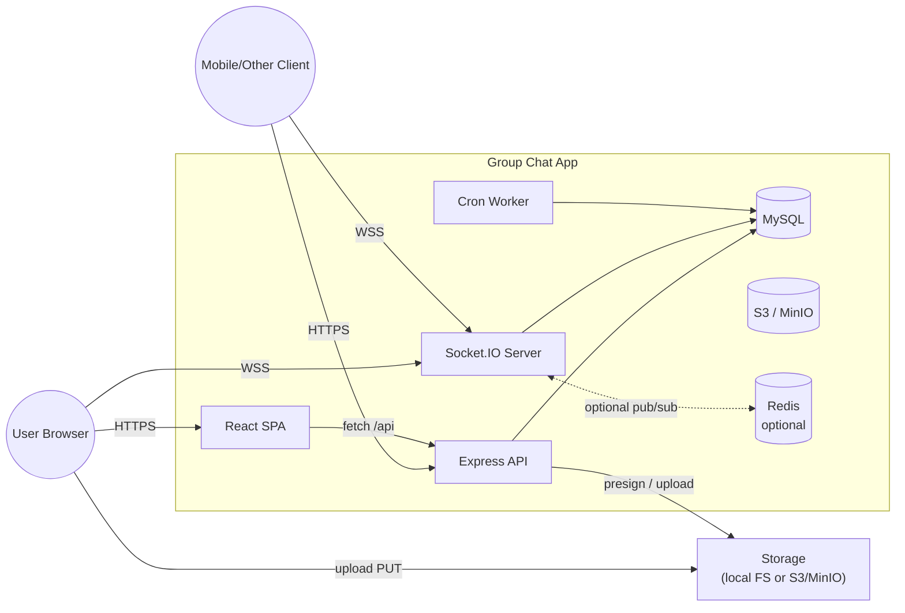
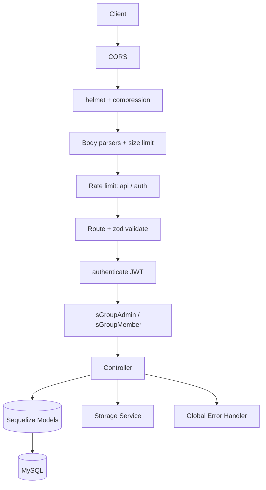
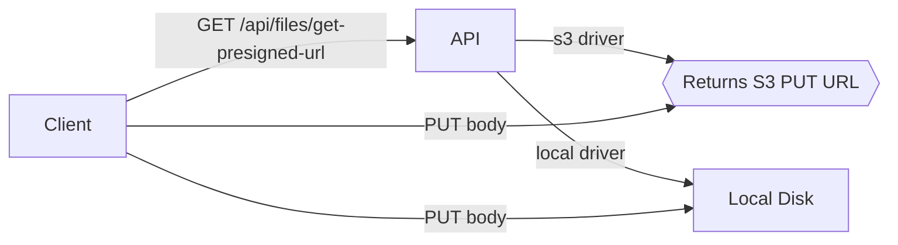
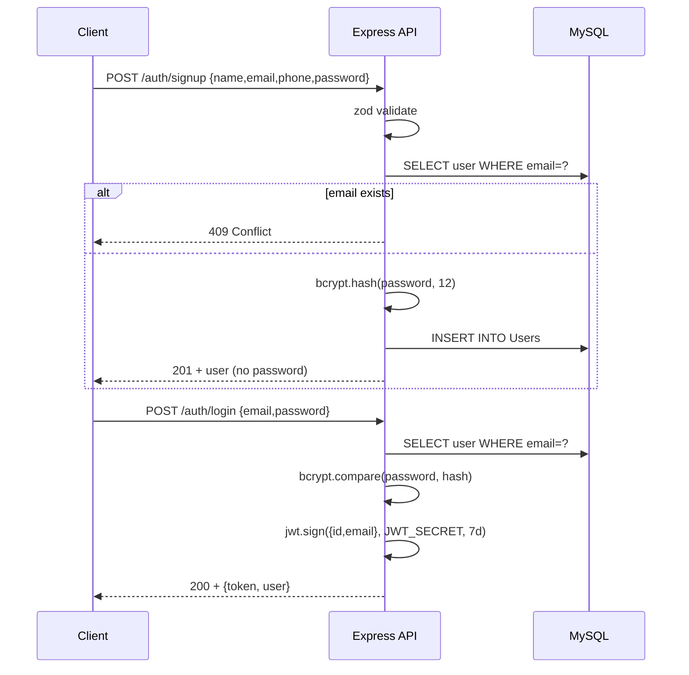
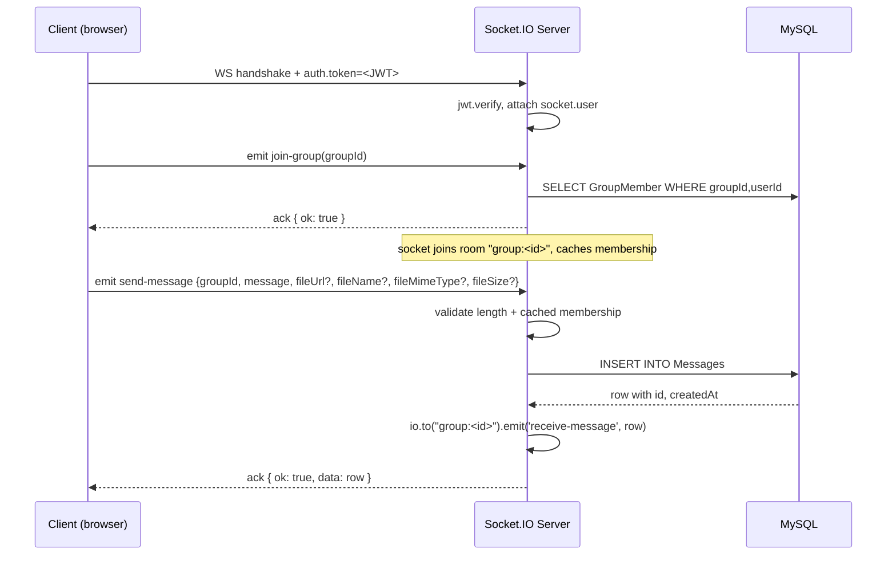
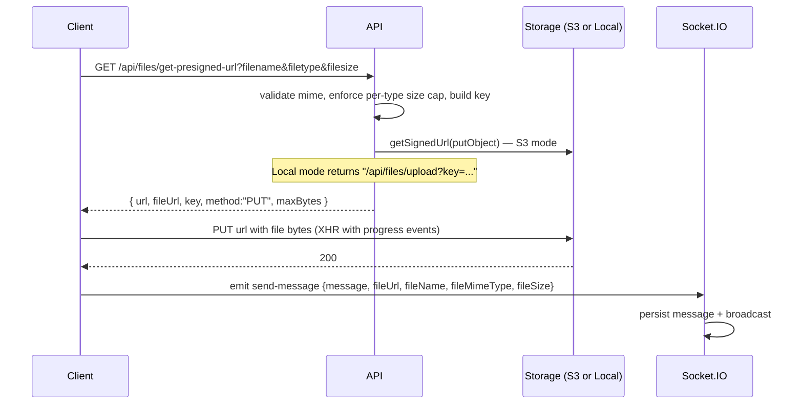
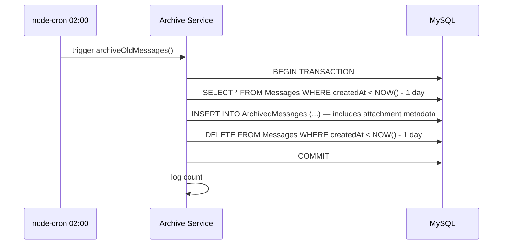
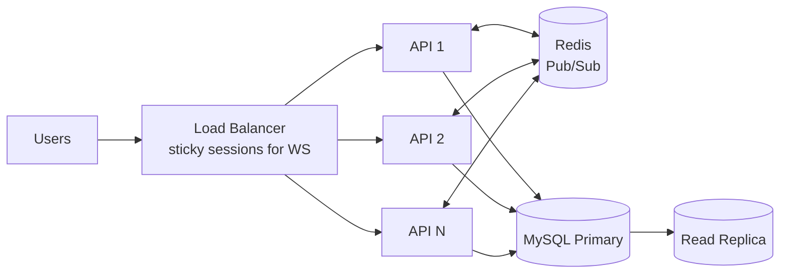
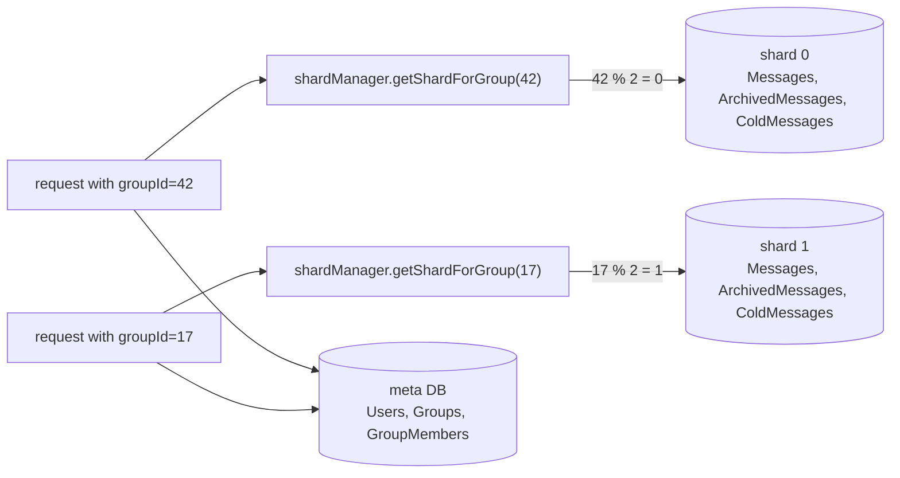

# High-Level Design — Group Chat App

This document describes the system architecture, the role of each component, the data flows for major operations, and how the system would scale beyond a single instance.

---

## 1. Goals & Constraints

| Goal                                  | Approach                                                       |
| ------------------------------------- | -------------------------------------------------------------- |
| Real-time messaging                   | WebSockets via Socket.IO (with HTTP long-poll fallback)        |
| Persistent history                    | MySQL (relational, ACID, well understood by interviewers)      |
| Strong auth                           | JWT for stateless API + Socket.IO handshake auth               |
| Horizontal scale path                 | Stateless API + Redis pub/sub adapter for sockets              |
| Pluggable file storage                | Driver pattern: `local` (dev) → `s3` (prod) without code changes |
| Hot table stays small                 | Daily cron moves day-old messages to an archive table          |
| Rich attachments                      | Per-mime size limits; image/video/audio/doc rendering          |
| Group lifecycle                       | Invite, promote, remove, leave; admin RBAC                     |

**Non-goals (deliberately out of scope):**

- End-to-end encryption (would require client-held keys)
- Voice / video calls (would need a media server like mediasoup)
- Federated / multi-tenant (single-tenant MVP)

---

## 2. System Context



---

## 3. Component Overview

### 3.1 Frontend (React + Vite + Tailwind + TypeScript)

- **Routing:** `react-router` with `<ProtectedRoute>` guard.
- **State:** React Context for auth (`AuthContext`); local state inside chat room hook (`useChat`).
- **Networking:** axios with request/response interceptors (auto-attach JWT, auto-redirect on 401).
- **Real-time:** singleton Socket.IO client; reconnect with exponential backoff up to 5s.
- **Uploads:** XHR-based with progress events; presigned upload then `send-message` with metadata.
- **Attachments rendering:** images inline, HTML5 video/audio players, doc/pdf/zip cards with mime badge.
- **Member management:** drawer UI; admin-only invite/promote/remove + per-user "Leave group".
- **UX:** typing indicators throttled to 1 event / 1.5s, auto-cleared after 2.5s of inactivity.

### 3.2 Backend API (Express 5)

Layered architecture:



### 3.3 Realtime Layer (Socket.IO)

Sits next to Express on the same HTTP server.

- Authenticated via JWT on **handshake** (`auth.token`) — disconnects without valid token.
- Per-group rooms (`group:<id>`).
- Per-socket cached membership set (avoids DB roundtrip per message).
- All persistence is server-side; clients can never spoof `userId`/`userName`.
- Optional **Redis pub/sub adapter** (activated by `REDIS_URL`) for multi-instance deployments.

### 3.4 Database (MySQL 8)

Five tables: `Users`, `Groups`, `GroupMembers`, `Messages`, `ArchivedMessages`. Composite indexes on `(groupId, createdAt)` for the hot read pattern. `Messages` and `ArchivedMessages` carry attachment metadata (`fileUrl`, `fileName`, `fileMimeType`, `fileSize`). See [LLD.md](./LLD.md) for the full ERD.

### 3.5 Storage Service (driver pattern)



Both drivers expose the same interface — frontend code is identical regardless of driver. Server enforces a per-mime byte cap (image 10 MB, video 100 MB, audio 25 MB, doc/pdf 25 MB, archive 50 MB).

### 3.6 Cron Worker — multi-tier archive lifecycle

Two crons in `cron/archiveJob.js`. They run inside the API process for now but are designed to be extracted to a dedicated worker.

| Tier      | Source table        | Destination       | Cutoff         | Schedule                  |
| --------- | ------------------- | ----------------- | -------------- | ------------------------- |
| Hot → Warm | `Messages`          | `ArchivedMessages` | 24 hours old   | `0 2 * * *` (daily 02:00) |
| Warm → Cold | `ArchivedMessages` | `ColdMessages`    | 30 days old    | `0 3 * * 0` (Sun 03:00)   |

Each move is a single DB transaction per shard. Hot reads always look only at `Messages`; clients that want historical data hit the archive endpoint (`/api/messages/:groupId/archive`) which fans out to warm + cold within a single shard.

Why this lifecycle:

- **Hot table stays small** → composite index `(groupId, createdAt)` fits in the buffer pool, recent-message reads are micro-second.
- **Warm tier** preserves the same row layout for cheap fallback reads.
- **Cold tier** carries an `archivedAt` column so retention/cleanup jobs can age out further (deep-freeze to S3, then delete).

> **Scaling note:** in a multi-instance deploy, the in-process cron would run on every instance. Mitigation: extract the worker into a separate dyno that only one instance runs, or use a leader-election lock (Redis `SETNX`).

---

## 4. Key Data Flows

### 4.1 Sign-up + Login



### 4.2 Send a message (via WebSocket)



### 4.3 Upload + send a file



The browser uploads **directly** to S3 in production — the API never proxies the bytes, saving bandwidth and CPU. In the local driver, the API receives the bytes and writes to disk.

### 4.4 Member management

```mermaid
sequenceDiagram
    participant Admin as Admin user
    participant API as Express API
    participant DB as MySQL

    Admin->>API: POST /api/groups/:id/invite {email}
    API->>API: authenticate + isGroupAdmin
    API->>DB: SELECT user by email; check no existing membership
    API->>DB: INSERT INTO GroupMembers
    API-->>Admin: 200 + invited user

    Admin->>API: POST /api/groups/:id/promote {userNameToPromote}
    API->>DB: UPDATE GroupMembers SET is_admin=true
    API-->>Admin: 200

    Admin->>API: POST /api/groups/:id/remove {userEmailToRemove}
    API->>DB: SELECT group, refuse if target == createdBy
    API->>DB: DELETE FROM GroupMembers
    API-->>Admin: 200

    Note over API: any member can call /leave; group creator cannot leave
```

### 4.5 Daily archive



The transaction guarantees we never have messages in **both** tables, or in **neither**.

---

## 5. Failure Modes & Resilience

| Failure                        | Effect                              | Mitigation                                                   |
| ------------------------------ | ----------------------------------- | ------------------------------------------------------------ |
| MySQL down at boot             | Process exits with code 1           | Orchestrator restart; alert via process-supervisor logs       |
| MySQL drops mid-flight         | Sequelize raises, sent through global error handler | Connection pool retries acquire (30s timeout)               |
| WebSocket disconnects          | Client auto-reconnects (10x, ≤5s) — re-emits `join-group`, no message loss because all messages are persisted server-side |
| JWT expires                    | Server returns 401                  | Frontend interceptor clears token, redirects to /login        |
| Brute-force login              | `authLimiter` blocks after 10 / 15min per IP | Returns 429                                                  |
| Oversized JSON body            | `express.json({limit:'1mb'})` rejects with 413 | Prevents memory DoS                                           |
| Oversized file upload          | Per-mime cap server-side; local driver rejects mid-stream once cap hit | 413 returned; partial file discarded                         |
| Disallowed mime type           | Storage service throws 400          | Client shows toast, no DB row written                         |
| S3 down (s3 driver)            | Presign succeeds, client upload fails | Frontend toast; user retries — no DB row written (so no orphan) |
| Archive cron fails             | Caught, logged, transaction rolled back | Job re-runs next day; idempotent (cutoff-based)               |
| Process killed (SIGTERM)       | Graceful shutdown drains in-flight then closes DB | 10s force-exit if drain hangs                                |
| Redis down (when REDIS_URL set) | Adapter logs error; sockets continue working on local instance | Once Redis comes back, adapter reconnects                    |

---

## 6. Scaling

### 6.1 Vertical (single instance)

- Connection pool max 10 → ~hundreds of req/s for typical CRUD
- Socket.IO single Node process: ~1k-10k concurrent connections depending on hardware

### 6.2 Horizontal — N stateless API instances (already wired in)



Implementation status in this repo:

| Required | Status |
| --- | --- |
| ✅ **`@socket.io/redis-adapter`** so a broadcast on instance A reaches sockets on instance B | Wired in `services/socketService.js` — `attachRedisAdapter` activates when `REDIS_URL` is set; otherwise single-instance mode. |
| 🟡 **Sticky sessions** at the load balancer | Configured at deploy time (Render handles this; for raw Nginx, `ip_hash` directive). |
| 🟡 **External cron** — extract `archiveJob.js` into its own one-off worker that only one instance runs | Currently in-process. Migration plan: deploy a separate Render "background worker" service with `CRON_ONLY=true`, gate the cron import in `server.js` on that flag. |
| 🟡 **Read replicas** for hot read traffic | Sequelize supports `replication: { read: [...], write: ... }`. Add when traffic justifies it. |

### 6.3 Application-level sharding (implemented; opt-in)

This repo ships a working sharding implementation that you turn on with a single env var. Default `SHARD_COUNT=1` keeps everything on one DB (identical to non-sharded behavior); `SHARD_COUNT>=2` activates real shard routing.

**The model:**



**Layout:**
- **Meta DB** (always 1) — `Users`, `Groups`, `GroupMembers`. Small, frequently joined, never sharded.
- **Shards** (1..N) — `Messages`, `ArchivedMessages`, `ColdMessages`. One set of tables per shard.

**Routing rule:** `shardIndex = groupId % SHARD_COUNT`. Consistent — a given group always lives on the same shard, so:
- A single message INSERT touches one shard.
- A single group's history scan reads one shard.
- The archive cron iterates all shards independently (per-shard transactions).

**What's NOT possible (and how we deal with it):**

| Concern | How we handle it |
| --- | --- |
| Cross-shard joins (`Message → User`) | We **denormalize** `userName` onto `Message`. No JOIN needed. |
| Cross-group analytics | Iterate all shards, aggregate in app code. We don't have those queries today. |
| Distributed transactions across shards | We avoid them. Group/member writes are on meta DB; message writes are on the message's shard. The two never need to be atomic together. |
| Archive cron consistency | Each shard's hot→warm→cold move is a single-shard transaction. Independent shards can fail/retry independently. |

**Code structure:**
- [`config/shards.js`](../config/shards.js) — `getShardForGroup(groupId)`, `allConnections()`, `connectAll()`.
- [`models/index.js`](../models/index.js) — meta models on `metaDb`, message models replicated across each shard's Sequelize instance, sharded accessors `getMessage(groupId)` etc.
- [`services/socketService.js`](../services/socketService.js) — uses `getMessage(groupId)` for the write.
- [`services/archiveMessages.js`](../services/archiveMessages.js) and [`services/coldArchiveMessages.js`](../services/coldArchiveMessages.js) — iterate `allMessageShards()` and run a transaction per shard.
- [`scripts/setup-shards.js`](../scripts/setup-shards.js) — `npm run setup:shards` creates the shard databases on your MySQL host.

**Operating modes:**

| Mode | env config | Behavior |
| --- | --- | --- |
| Single-DB (default) | `SHARD_COUNT=1` (or unset) | Meta + messages on one DB. One pool. Identical to baseline. |
| Logical sharding | `SHARD_COUNT=2`, `SHARD_DBS=group_chat_shard_0,group_chat_shard_1` | Multiple databases on **same** MySQL host. Demonstrates routing without operational overhead. Used for local dev and the demo. |
| Physical sharding | Same as logical but each DB is on a different MySQL host | Replace `DB_HOST` with a per-shard host map (small extension to `config/shards.js`). True throughput scaling. |

**Try it locally:**
```bash
# 1. Tell the app you want 2 shards
echo 'SHARD_COUNT=2' >> .env
echo 'SHARD_DBS=group_chat_shard_0,group_chat_shard_1' >> .env

# 2. Create the databases (idempotent)
npm run setup:shards

# 3. Restart the server — Sequelize syncs the schema on each shard
npm run dev
```

After that, every message your app writes is routed by `groupId % 2`. Inspect with:
```sql
USE group_chat_shard_0; SELECT id, groupId FROM Messages;
USE group_chat_shard_1; SELECT id, groupId FROM Messages;
```
Group 1, 3, 5… in shard 1; group 2, 4, 6… in shard 0.

### 6.4 Why this kind of sharding for chat (and the trade-offs)

Even though chat usually doesn't *need* application-level sharding, the access pattern is one of the cleanest fits for hash sharding when you do:

- **Single-key access.** Every message read/write specifies `groupId`. No fan-out queries on the hot path.
- **No FK relationships across shards.** Users live elsewhere; messages denormalize the bits they need.
- **Pre-existing partition key.** `groupId` distributes naturally; no synthetic shard keys needed.

Trade-offs we accept:

- **Cross-group features** (global search, "messages by user X across all groups") become app-side fan-out + aggregation. We don't have those features today; if we did, we'd push them off the OLTP path to an Elasticsearch index.
- **Resharding** (moving from 2 → 4 shards) requires migrating rows. Mitigations: **consistent hashing** instead of modulo, or **virtual shards** (logical 1024 shards mapped to physical N), so adding capacity moves only `1/N` of the data.
- **Hot shards.** If one group is 100x more active than the rest, that shard is a hotspot. Mitigations: split high-traffic groups across shards by `(groupId, dayBucket)` instead of just `groupId`.

### 6.4 At even larger scale

- **Message fan-out queue** (Kafka / NATS / Redis Streams) decouples persistence from delivery.
- **Cassandra/ScyllaDB for messages** if write throughput dominates and joins aren't needed.
- **Kafka Connect → Elasticsearch** for full-text message search.
- **Edge presence** — push presence/typing state to a regional Redis cluster for sub-100ms updates globally.

---

## 7. Security Posture

| Threat                       | Defense                                                        |
| ---------------------------- | -------------------------------------------------------------- |
| Credential stuffing          | bcrypt 12 rounds + auth rate limiter                           |
| User enumeration via login   | Same error message for unknown email and wrong password        |
| Token theft                  | HTTPS-only in prod; short-lived JWT (7d); add refresh tokens for prod-grade |
| XSS                          | helmet sets CSP-friendly headers; React auto-escapes by default |
| CSRF                         | SPA uses bearer tokens not cookies → CSRF not applicable; if cookies were used, would add `SameSite=Lax` + CSRF token |
| SQL injection                | Sequelize parameterized queries everywhere                     |
| File upload abuse            | Mime allowlist; per-type size caps; presigned URL expires in 60s; local driver streams + drops if cap exceeded |
| Spoofed sender on socket     | Server uses `socket.user.id`, never trusts client-supplied id   |
| Open file endpoint           | `/api/files/*` requires JWT (was open in v1 — fixed)            |
| Secrets in repo              | `.env` git-ignored; zod fails fast if missing; CI/pre-commit hook recommended |
| Privilege escalation         | `isGroupAdmin` middleware runs before admin-only controllers; `removeMember` refuses if target is group creator |

---

## 8. Observability (current → next)

**Current:**

- `winston` with JSON output in production
- Health check `/healthz` for orchestrator probes
- Sequelize query logs in dev mode

**Next steps for production:**

- Request ID middleware → correlate logs across HTTP + Socket events
- `prom-client` for Prometheus metrics (req/s, p50/p95 latency, active sockets)
- Distributed tracing via OpenTelemetry → Jaeger
- Alerting on 5xx rate, p95 latency, disk usage on uploads

---

## 9. Trade-offs & Decisions

| Decision                              | Why                                                                         | Trade-off                                       |
| ------------------------------------- | --------------------------------------------------------------------------- | ----------------------------------------------- |
| MySQL over MongoDB                    | Strong consistency, well-understood by everyone, group/user joins are easy  | Less natural for massive write throughput       |
| Sequelize over raw SQL                | Productivity, model + association declaration                              | Hides query plans; need to verify generated SQL |
| Socket.IO over native WS              | Built-in fallbacks, rooms, and Redis adapter                                 | Larger bundle; protocol non-standard            |
| JWT over server sessions              | Stateless API → trivial horizontal scale                                    | Logout/revocation harder; need short TTL or denylist |
| In-process cron                       | Simplicity for a single-instance deploy                                     | Doesn't scale to N instances without leader election |
| Pluggable storage driver              | Same code path local + cloud                                                 | Slightly more abstraction up front              |
| zod over Joi/Yup                      | TS-native, schema → types automatically                                     | Smaller ecosystem of integrations               |
| Per-mime byte caps over global cap    | Prevents 100MB-image abuse while allowing 100MB videos                      | Slightly more config to maintain                |
| Server-side file metadata persistence | Trustworthy attachment record; supports archive job                          | Schema migration when adding new fields         |
