# Low-Level Design — Group Chat App

DB schema, indexes, query plans, sequence diagrams, and API contracts.

---

## 1. Database Schema

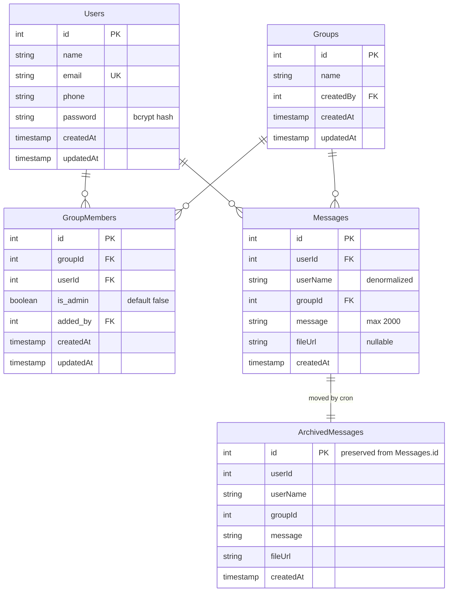

### 1.1 Index Strategy

| Table             | Index                           | Why                                                          |
| ----------------- | ------------------------------- | ------------------------------------------------------------ |
| `Users`           | UNIQUE (`email`)                | Fast lookup at login + uniqueness                             |
| `GroupMembers`    | UNIQUE (`groupId`, `userId`)    | Prevents duplicate membership at the DB level (race-safe)     |
| `GroupMembers`    | (`userId`)                      | Fast "groups for this user" query                             |
| `Messages`        | (`groupId`, `createdAt`)        | The hot read query: messages of a group in time order         |
| `Messages`        | (`userId`)                      | "All messages by user X" use case                             |

**Why `(groupId, createdAt)` not just `(groupId)`?**
The leftmost-match rule of B-tree indexes: a composite index serves any prefix. `(groupId, createdAt)` accelerates both `WHERE groupId = ?` and `WHERE groupId = ? ORDER BY createdAt`. Adding the second column means MySQL avoids a filesort.

### 1.2 Why denormalize `userName` on Messages

Most reads of a message want to render "<name>: <text>". If we forced a JOIN to `Users` on every read, the index lookup becomes a join. Storing the name at write time:

- Pros: messages render with one index scan, no join
- Cons: if a user changes their name, old messages keep the old name. Acceptable for a chat app (matches WhatsApp/Slack behavior — old messages don't retroactively rename)

### 1.3 Foreign keys + cascading deletes

Defined in `models/index.js`:

- `User → Message` ON DELETE CASCADE — if a user is deleted, their messages go too
- `Group → Message` ON DELETE CASCADE — if a group is deleted, all its messages
- `User → GroupMember` ON DELETE CASCADE — if user deleted, memberships gone
- `Group → GroupMember` ON DELETE CASCADE — if group deleted, all memberships

---

## 2. API Contracts

Full reference in [API.md](./API.md). The contract is:

- All requests/responses are JSON.
- Successful responses: `{ success: true, message?, data }`.
- Errors: `{ success: false, message, details? }`.
- Auth: `Authorization: Bearer <jwt>` header.
- Status codes follow REST conventions (200, 201, 400, 401, 403, 404, 409, 413, 429, 500).

### 2.1 Validation Pipeline

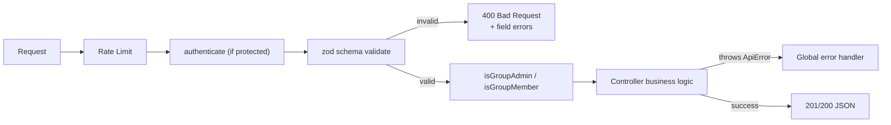

---

## 3. Auth Sequences

### 3.1 Token issuance

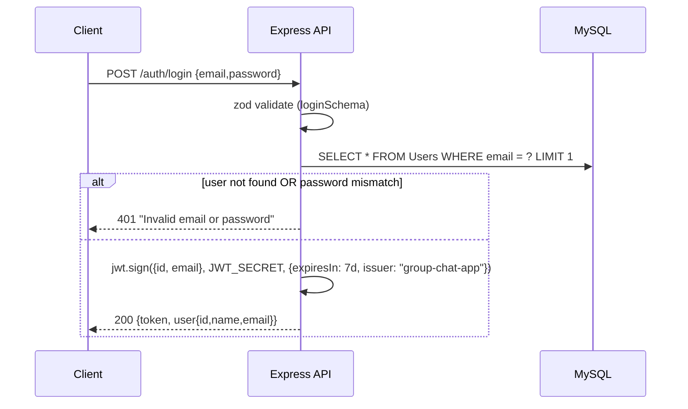

Note: same generic message for both "user not found" and "wrong password" — prevents user enumeration.

### 3.2 Authenticated request

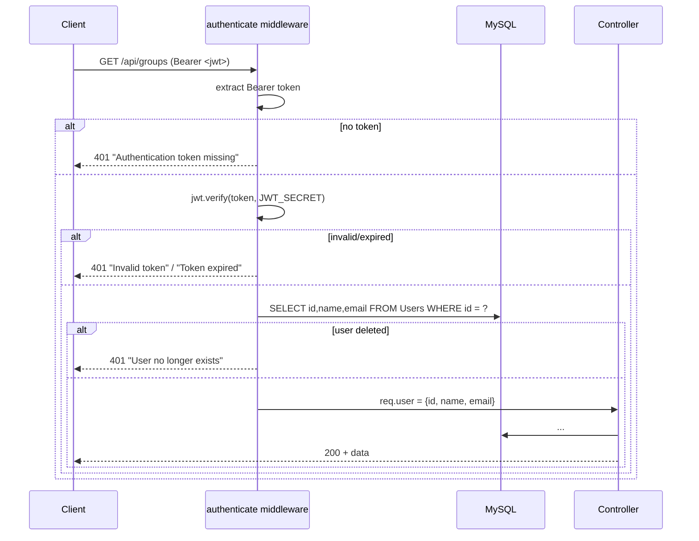

### 3.3 Socket.IO handshake auth

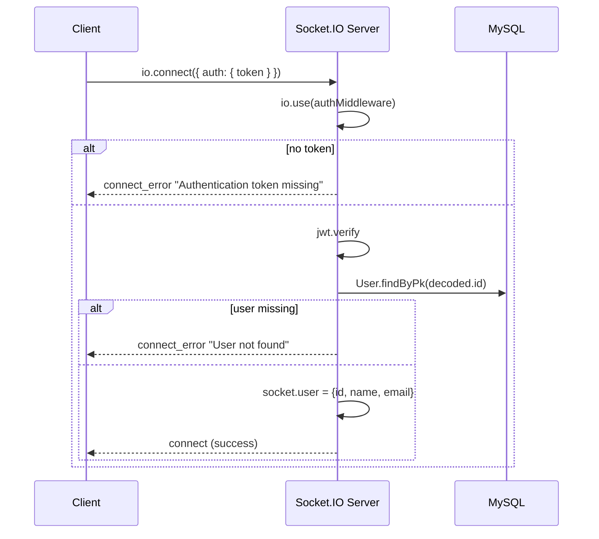

---

## 4. Group Operations

### 4.1 Create group (transactional)

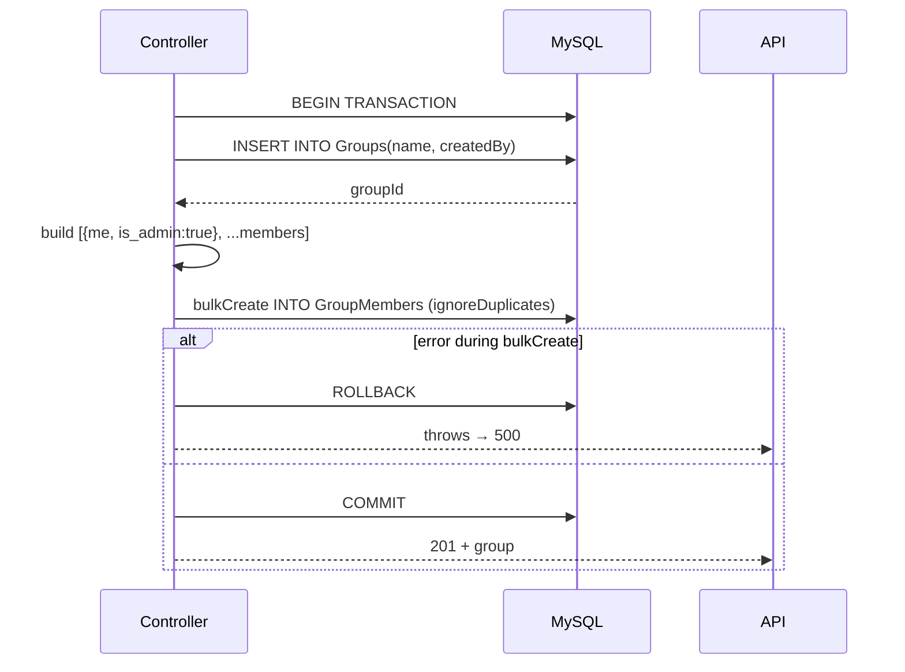

The transaction guarantees we never have a group without its creator attached as admin.

### 4.2 Invite user (admin only)

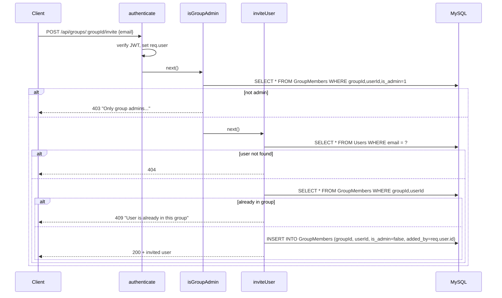

The unique index on `(groupId, userId)` is the safety net: even if two requests race past the `findOne` check, the DB rejects the second insert.

---

## 5. Messaging Sequence (full lifecycle)

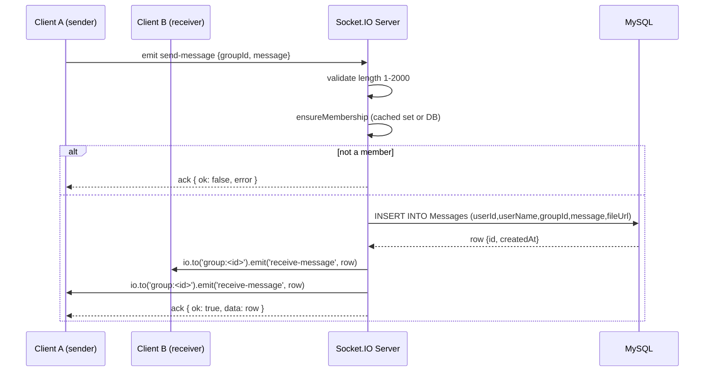

The sender also receives `receive-message` because they're in the room. The frontend dedups by `id` in `useChat`.

### 5.1 Why persist server-side, not client-side?

- A malicious client could spoof `userId`, `userName`, or `createdAt`.
- The server has the only trusted view of `socket.user.id` from the JWT.
- Persisting on the server also means messages survive a client disconnect mid-send.

---

## 6. File Upload Sequence

### 6.1 S3 driver (production)

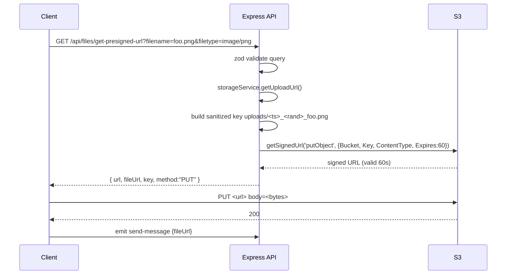

### 6.2 Local driver (dev)

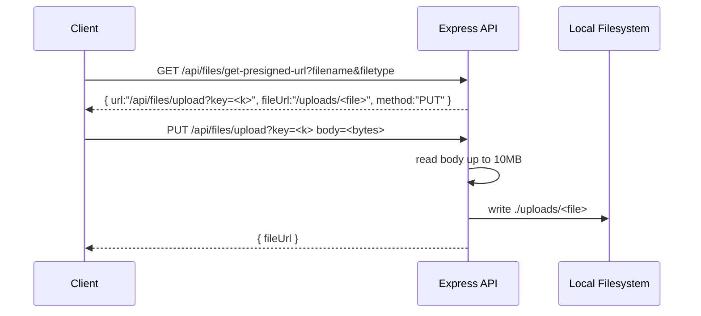

Same client code. Same `fileUrl` shape. The only difference is the URL the browser PUTs to.

---

## 7. Cron — Daily Archive

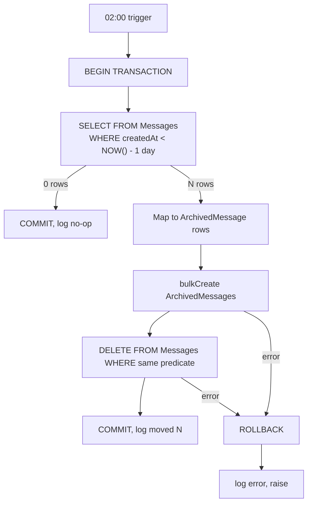

**Idempotency:** If the job runs twice in a day, the second run finds no rows and is a no-op. Cutoff uses **wall-clock NOW()**, not a stored "last-run" timestamp.

---

## 8. Concurrency / Race Conditions

| Race                                                  | Defense                                                                    |
| ----------------------------------------------------- | -------------------------------------------------------------------------- |
| Two signups with same email                           | Unique index on `Users.email` → second insert fails with `SequelizeUniqueConstraintError` (mapped to 409 by errorHandler) |
| Two `inviteUser` calls add same user simultaneously   | Unique `(groupId, userId)` index on `GroupMembers` rejects the second      |
| `createGroup` partial — group created but bulkCreate fails | Wrapped in Sequelize transaction → all or nothing                          |
| Archive job middle of write — race between SELECT and DELETE | Same transaction, both queries use the same NOW() cutoff                   |
| Socket disconnect while DB write in flight            | DB write completes, message persists; `receive-message` broadcast still fires to other room members |

---

## 9. Sample Query Plans

```sql
-- Hot read: latest 50 messages of a group
EXPLAIN SELECT * FROM Messages
  WHERE groupId = 42
  ORDER BY createdAt DESC
  LIMIT 50;

-- With composite (groupId, createdAt) index:
-- type=ref, key=idx_messages_groupId_createdAt, rows≈50, Extra: "Backward index scan"
```

```sql
-- Find groups for a user
EXPLAIN SELECT g.* FROM Groups g
  JOIN GroupMembers gm ON gm.groupId = g.id
  WHERE gm.userId = 17;

-- With (userId) index on GroupMembers:
-- gm: type=ref, key=idx_group_members_userId
-- g:  type=eq_ref, key=PRIMARY (joined by groupId)
```

---

## 10. State Transitions

### Group lifecycle

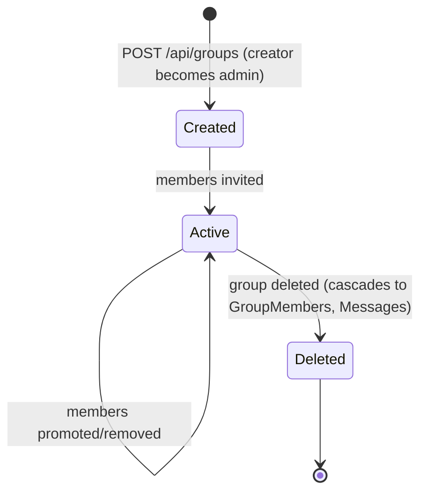

### Message lifecycle

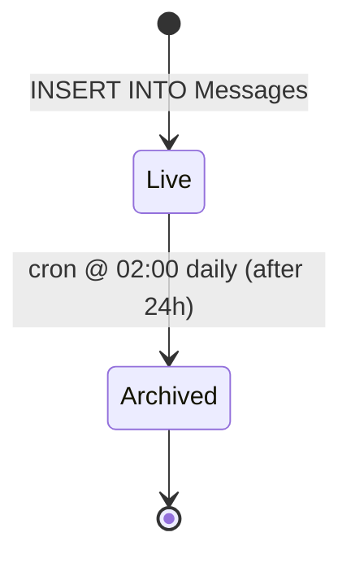
